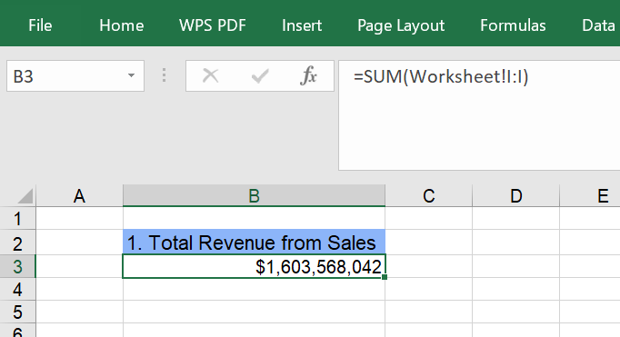
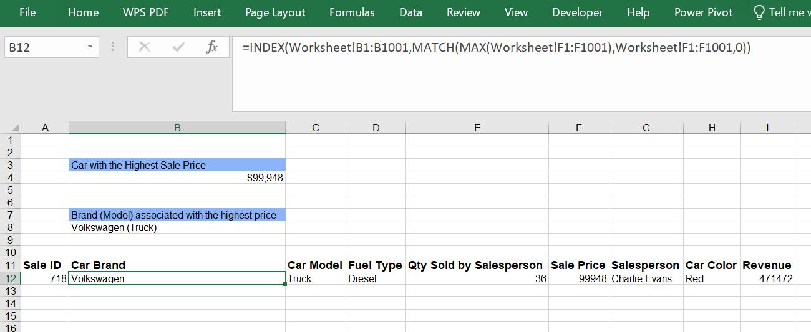
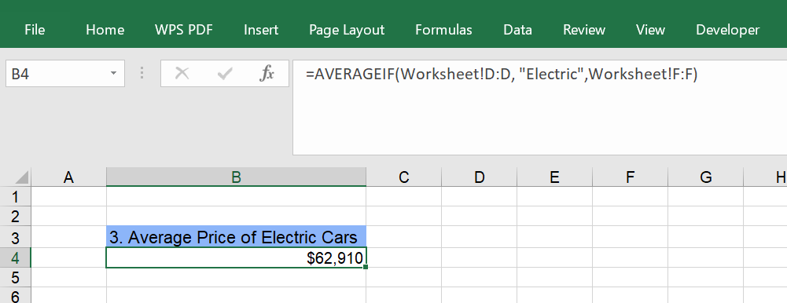
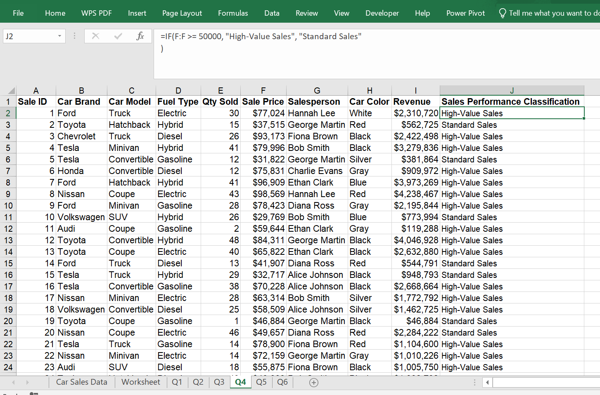
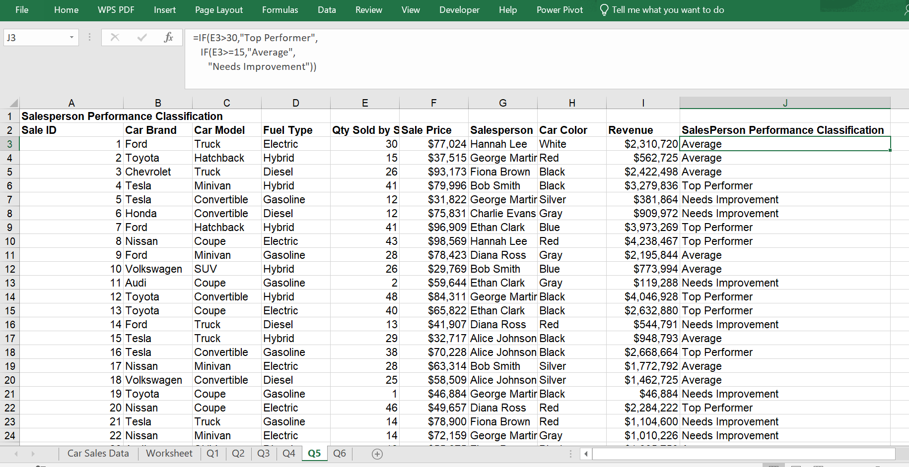
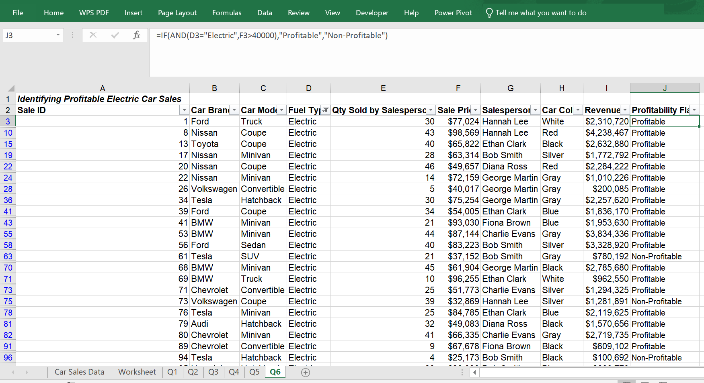

# Nextgen Automotive Sales Analysis

## Project Overview

NextGen Automotive Sales Group is a high-volume dealership operating across multiple vehicle segments, including a growing portfolio of Electric Vehicles (EVs), hybrids, diesel, and gasoline models. With over 1,000 recorded transactions and eight active sales representatives, the dealership processes a significant volume of business annually, generating over $1.6 billion in total revenue. The group competes in a diverse pricing landscape and aims to maximise profitability by capitalising on premium vehicle segments.

This analysis provides a comprehensive assessment of the dealership's revenue streams, product pricing tiers, and individual salesperson effectiveness.  
By transforming raw transactional data into actionable intelligence through structured Excel-based analysis, this project supports leadership in optimising inventory decisions, identifying high-performing talent, and refining incentive structures to sustain long-term growth.

---

## Tools & Methodology

The analysis was conducted entirely within Microsoft Excel, leveraging a dataset of 1,000 sales transactions spanning 10 car brands, 4 fuel types, and 8 salespersons.

Prior to analysis, the dataset underwent data quality validation to confirm the absence of duplicate records and missing values, and to ensure formatting consistency across all fields.

Each business question was addressed in a dedicated worksheet, with all calculations driven by Excel formulas to ensure dynamic, scalable outputs.

The functions applied include `SUM`, `MAX`, `INDEX`, `MATCH`, `AVERAGEIF`, `IF`, `COUNTIF`, and `AND` selected based on the specific aggregation or classification requirements of each question.

---

## Analysis & Findings

### 1. Total Revenue from Sales

Revenue was calculated by first deriving a **Revenue column** (Sale Price × Quantity Sold by Salesperson) in the working dataset, then aggregating using `SUM` across the full range. This approach accounts for volume sold per transaction, ensuring revenue accurately reflects units moved rather than list price alone.

**Result:**

---

### 2. Highest-Value Vehicle Sale

The `MAX` function was used to identify the peak sale price within the dataset. To retrieve the corresponding vehicle, `INDEX` and `MATCH` were combined to locate the brand and model associated with that price point, with concatenation used to present both fields in a readable format.

**Result:**

---

### 3. Average Price of Electric Cars

A conditional average (`AVERAGEIF`) was applied to isolate only electric vehicle transactions. This ensures that price calculations for the EV segment are not skewed by other fuel types, providing a clean benchmark for EV pricing performance.

With 261 of the 1,000 transactions being electric vehicles the largest single fuel-type segment in the dataset. The EV average of $62,910.

**Result:**

---

### 4. Sales Performance Classification

Each transaction was classified as either **High-Value** (sale price ≥ $50,000) or **Standard** (sale price < $50,000) using a nested `IF` function applied across the full dataset. This classification enables quick segmentation of the revenue portfolio and supports targeted inventory and pricing decisions.

**Result**

---

### 5. Salesperson Performance Classification

Each salesperson was classified as **Top Performer**, **Average**, or **Needs Improvement** based on quantity of units sold per transaction, using a nested `IF` evaluation. Unique representatives were first enumerated, and `COUNTIF` was used to aggregate their transaction volumes before classification thresholds were applied.

**Result**

---

### 6. Identifying Profitable Electric Car Sales

To flag profitable EV transactions, a compound condition was evaluated using the `AND` function nested within `IF`: transactions were labelled **'Profitable'** only where the fuel type was Electric and the sale price exceeded $40,000. The dataset was then filtered to electric vehicles for focused review.

**Result**

---

## Key Business Insights

- Total revenue generated exceeded **$1.6 billion**, indicating strong overall sales performance.
- The highest individual sale was **$99,948**, recorded for a Volkswagen Truck.
- Electric vehicles maintain a relatively high average selling price of **$62,910**, suggesting strong premium positioning.
- High-value transactions (≥ $50,000) represent a significant portion of revenue contribution.
- Sales performance classification enables management to identify top performers and those requiring support.
- **80.5% of EV transactions are profitable** (> $40,000), making the EV segment a reliable driver of margin-positive business.

---

## Recommendations

- **Focus marketing efforts** on high-performing sales representatives to scale performance.
- **Expand electric vehicle inventory** due to strong pricing performance.
- **Implement incentive programs** tied to performance classification.
- **Monitor high-value electric car transactions** as a profitability KPI.

---

## Limitations & Considerations

This analysis is based on a single snapshot of 1,000 transactions and does not reflect trends over time. Without date fields or historical comparators, it is not possible to determine whether performance is improving, declining, or seasonal in nature.

The profitability threshold for electric vehicles ($40,000) was applied as a fixed rule. In practice, profitability depends on cost of goods, dealership overheads, and financing arrangements none of which are captured in the current dataset. The flag should therefore be interpreted as a **pricing proxy**, not a true margin metric.

Salesperson performance classification is based on quantity sold per transaction rather than total units or revenue generated over a period, which may not fully reflect sustained performance or account for differences in the types of vehicles each representative handles.

---

## Conclusion

This analysis demonstrates that NextGen Automotive Sales Group operates with strong fundamentals: a billion-dollar revenue base, a dominant share of high-value transactions, and a growing electric vehicle segment that is both popular and predominantly profitable.

The dealership's sales team is largely performing at a high level, with **six of eight representatives** meeting the Top Performer threshold.

By formalising the classification frameworks developed here into regular reporting cycles, leadership will be equipped to make faster, more confident decisions around inventory investment, staff development, and pricing strategy.

The foundation is strong; the opportunity now lies in converting these insights into sustained operational improvements.
